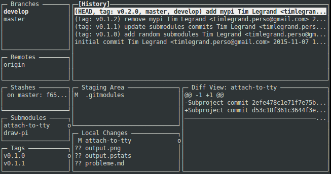

.. image:: https://img.shields.io/travis/timlegrand/giterm.svg
    :alt: Travis-ci build information

.. image:: https://badge.fury.io/py/giterm.svg
    :alt: giterm is officially packaged at PyPI
    :target: https://badge.fury.io/py/giterm

.. image:: https://img.shields.io/pypi/dm/giterm.svg
    :alt: giterm can be found on PyPI official

.. image:: https://img.shields.io/pypi/status/giterm.svg
    :alt: giterm development status

.. image:: https://img.shields.io/pypi/l/giterm.svg
    :alt: giterm is released under BSD 2-Clause license

.. image:: https://badges.gitter.im/timlegrand/giterm.svg
    :alt: Join the chat at https://gitter.im/timlegrand/giterm
    :target: https://gitter.im/timlegrand/giterm?utm_source=badge&utm_medium=badge&utm_campaign=pr-badge&utm_content=badge

Features
========

Giterm brings information about the current status of your Git working
copy right in your terminal, *real-time*.

It shows in a single view:

- local branches, and which branch you’re currently on
- remote branches, and which branch the current local branch is
  tracking
- commit history, and which commit you are currently working from
- current changes
- a *diff* view of the selected file in the *changes* list

Real-time!
----------

Every change to the working copy (file edition/move or any Git command)
updates the GUI instantly. You can work as usual, and keep a terminal
open with giterm to get instant feedback on your actions.

Giterm essentially *shows* Git information. It does not support git actions
like commit, checkout, branch switching, committing. Only staging/unstaging
is supported at this time.

Installation
============

.. code-block:: bash

    pip install giterm

If you don’t have ``pip`` installed yet:

.. code-block:: bash

    curl -s https://bootstrap.pypa.io/get-pip.py | sudo python
    pip install giterm

Usage
=====

.. code-block:: bash

    cd path/to/git/working/copy
    giterm

Keymap
------

- [tab]: Toggle panel
- [shift + tab]: Reverse Toggle
- [up]/[down]: Scroll line by line
- [page up]/[page down]: Scroll screen by screen
- [h]: Log history
- [c]: Changes view
- [s]: Staging area
- [d]: Diff view
- [b]: Branches
- [r]: Remotes
- [t]: Tags
- [space]: Stage/unstage current file
- [q]: Quit

Requirements
============

Giterm needs the ``git`` executable to be installed and available in the
PATH of your system. Others dependencies should be automatically handled
by ``pip``.

Technical background
====================

Giterm uses subprocesses to call Git shell-based commands, and parses
their outputs to bring the relevant information to the user interface.

It also uses a watchdog to listen file changes in the current working
directory.

License
=======

This software is provided under the BSD 2-Clause License. Please read
the `LICENSE file`_ for further information.

Contribute
==========

See the `CONTRIBUTING file`_ for how to help out.

Many thanks for your support!

.. _LICENSE file: ./LICENSE
.. _CONTRIBUTING file: ./CONTRIBUTING.rst
